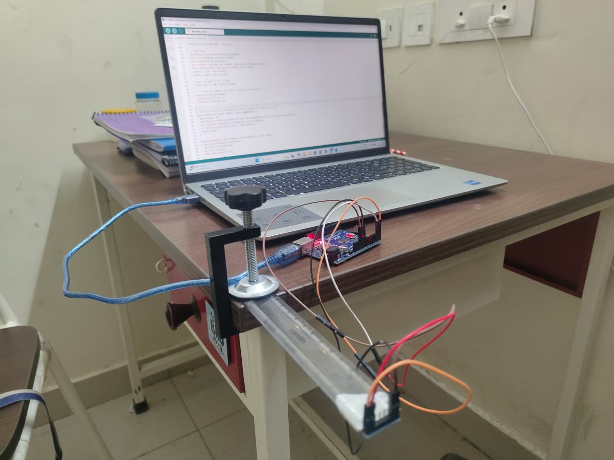
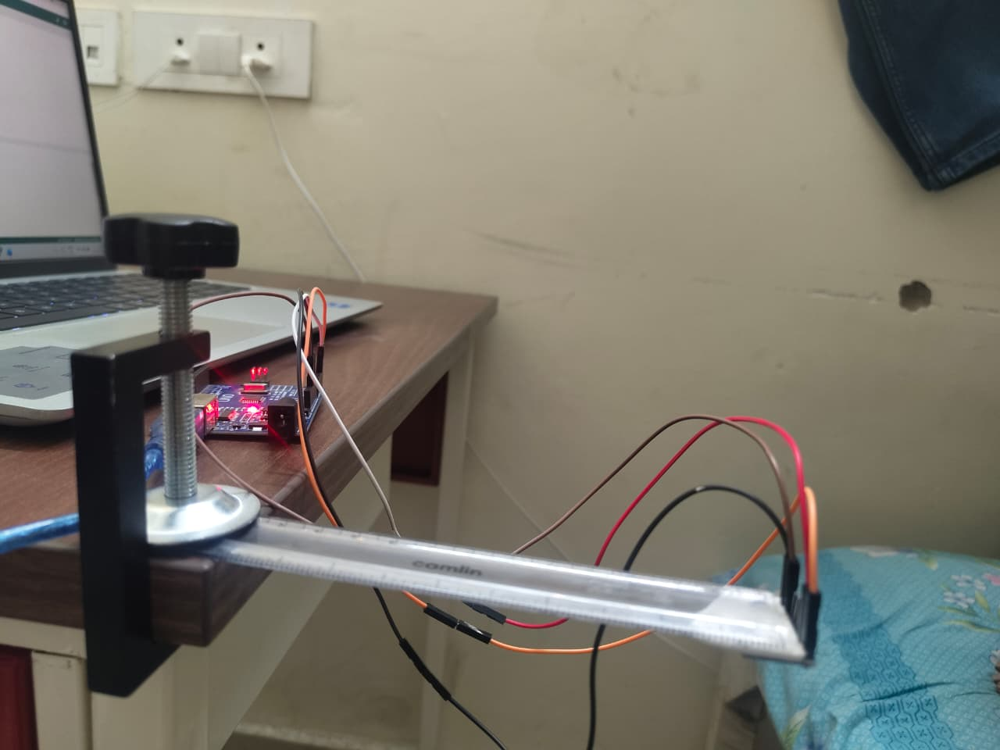
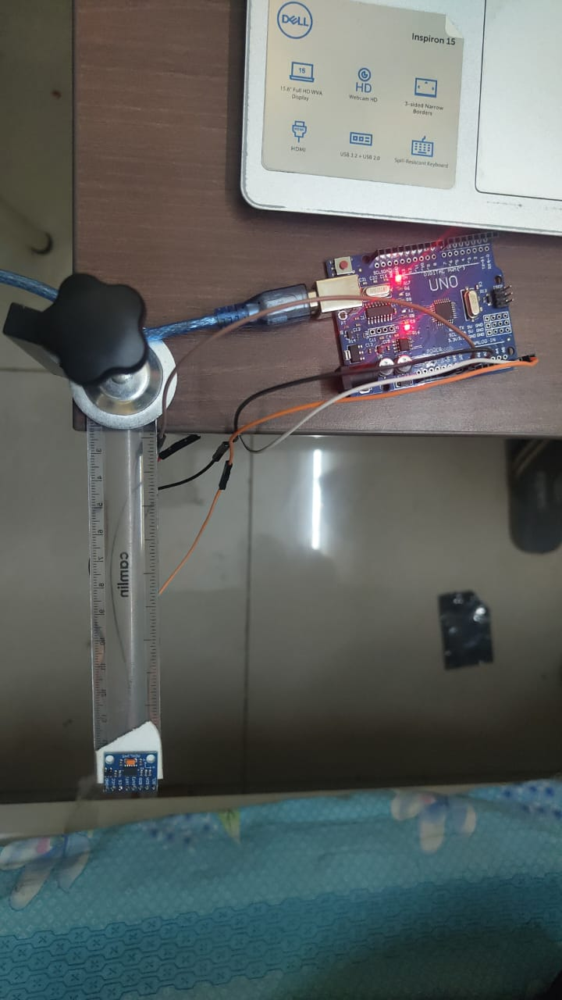

# Vibration Analysis of a Cantilever Beam

This project involves experimental and theoretical vibration analysis of a **cantilever beam** using an **Arduino Uno** and an **ADXL345 accelerometer**.  
The main goal is to determine the beam's **natural frequency** and validate the **Euler–Bernoulli beam theory** through **Fast Fourier Transform (FFT)**-based data analysis.

---

## 🧠 Project Overview

Vibration analysis is a crucial part of mechanical engineering design. Understanding how structures like beams, wings, or supports respond dynamically helps prevent **resonance** and **fatigue failure**.  
In this project, we experimentally measure the natural frequency of a cantilever beam and compare it with theoretical predictions.

The experimental setup uses:
- **Arduino Uno R3** for data acquisition
- **ADXL345 MEMS accelerometer** for vibration sensing
- **FFT analysis** to extract natural frequency from time-series data

---

## 🎯 Objectives

- To experimentally determine the **natural frequency** of a cantilever beam.  
- To validate the **Euler–Bernoulli beam model** by comparing measured frequencies with analytical predictions.  
- To study how **beam length** affects its natural frequency.  
- To analyze **damping characteristics** using logarithmic decrement.  
- To demonstrate that **low-cost Arduino-based systems** can effectively perform vibration analysis.

---

## ⚙️ Experimental Setup

The experiment consists of a **clamped cantilever beam** with a small **ADXL345 accelerometer** attached at the free end.  
The Arduino reads real-time acceleration data, which is processed via **FFT** to identify dominant vibration frequencies.

### Setup Images

| Experiment Setup | Close View | Top View |
|------------------|-------------|----------|
|  |  |  |

---

## 🧩 Equipment Used

- **Arduino Uno R3** – Microcontroller for data acquisition  
- **ADXL345 Accelerometer** – Measures vibration acceleration  
- **C-clamp** – Fixes the beam to create a cantilever condition  
- **Ruler Beam** – Serves as the vibrating structure  
- **Host Computer** – For FFT analysis and data visualization  

---

## 🧪 Experimental Procedure

1. Fix the beam using a **C-clamp** to ensure a rigid boundary condition.  
2. Attach the **ADXL345** sensor near the free end using light adhesive.  
3. Connect the sensor to the **Arduino Uno** and upload the data acquisition code.  
4. Give a small deflection at the free end and release to start **free vibration**.  
5. Record the acceleration data for ~10 seconds.  
6. Export the time-series data as a `.csv` file.  
7. Perform **FFT analysis** on the data to identify the natural frequency.  
8. Repeat for different beam lengths to study the frequency–length relationship.

---

## 📈 Data Analysis

- **FFT (Fast Fourier Transform)** converts the time-domain signal into the frequency domain.
- The **natural frequency** appears as a **dominant peak** in the amplitude–frequency plot.
- Damping is calculated from the amplitude decay curve using **logarithmic decrement**.

Mathematical relation for fundamental frequency:

$$
f_n = \frac{\beta_n^2}{2\pi L^2} \sqrt{\frac{EI}{\rho A}}
$$

where  
- $E$: Young’s Modulus  
- $I$: Moment of Inertia  
- $\rho$: Density  
- $A$: Cross-sectional Area  
- $L$: Beam Length  
- For the first mode: $\beta_1 L \approx 1.875$

---

## 💡 Key Observations

- The natural frequency **decreases** as beam length **increases**.  
- The experimental results match theoretical predictions closely.  
- The Arduino–ADXL345 system provides an **accurate, low-cost** setup for structural vibration analysis.  

---

## 📚 Conclusion

This experiment successfully demonstrates the relationship between beam length and natural frequency.  
The results validate the **Euler–Bernoulli beam theory** and show that **Arduino-based vibration testing** can yield reliable results for educational and research purposes.

---

## Author

- **Yashvardhansinh Rayjada**

---

